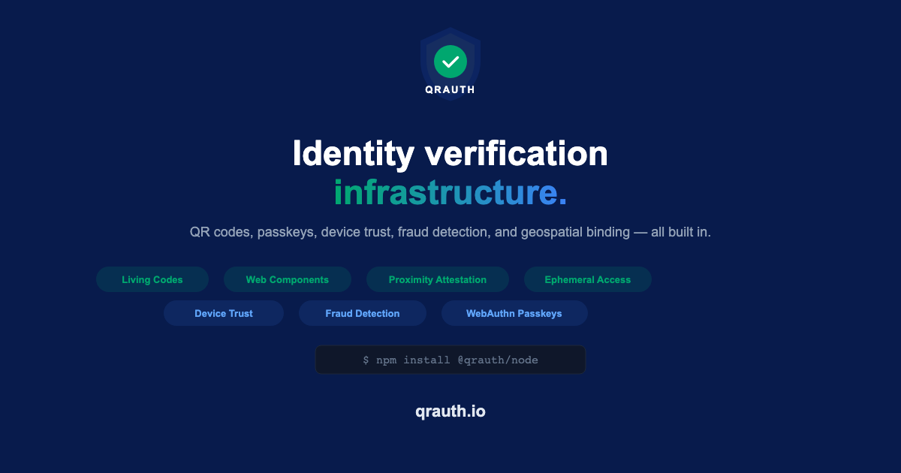
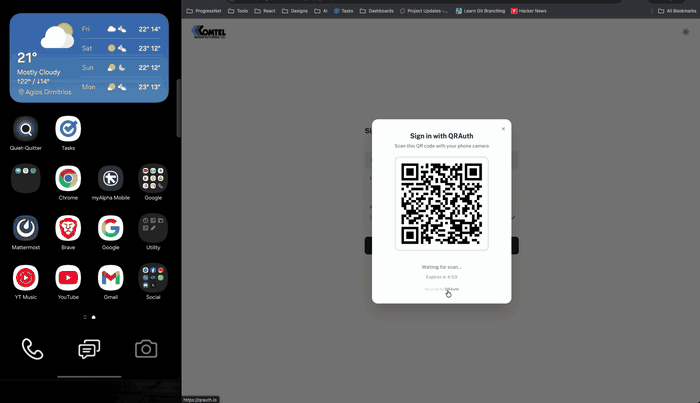

<p align="center">
  
</p>

<p align="center">
  <strong>Scan a QR with your phone, you're logged in.</strong><br />
  Drop-in passwordless authentication. Passkey-backed, signed end to end, open source.
</p>

<p align="center">
  <a href="https://qrauth.io">Website</a> &middot;
  <a href="https://docs.qrauth.io">Docs</a> &middot;
  <a href="https://docs.qrauth.io/api/overview.html">API Reference</a> &middot;
  <a href="https://github.com/qrauth-io/qrauth/issues">Issues</a>
</p>

<p align="center">
  
</p>

---

## Drop it into any website

```html
<script src="https://cdn.qrauth.io/v1/components-0.1.0.js"
        integrity="sha384-ImeeZSi6IaoKCDbLQkOMP1Lpx7W1d+1HDr8yKhdv2EKmkgXtjilu4Sf72iL2W7A6"
        crossorigin="anonymous"></script>
<qrauth-login tenant="your-app-id"></qrauth-login>
```

That's the whole integration. Passkey-backed, PKCE flow, SSE updates, Shadow DOM encapsulated, SRI-pinned. [Full web component docs →](https://docs.qrauth.io/guide/web-components.html)

---

## Three ways to use QRAuth

1. **Passwordless login** — Scan a QR with your phone or tap a passkey. Like WhatsApp Web, for any site. Zero password, zero app install.
2. **QR fraud protection** — Cryptographically signed QR codes with geospatial binding and transparency log. Verify physical codes haven't been swapped or cloned.
3. **Ephemeral delegated access** — Time-limited, device-bound QR sessions without consumer accounts.

## Trust model

- **Passkey-backed** — Native WebAuthn/FIDO2, passkeys coexist with QR auth under one identity.
- **ECDSA-P256 signatures** — Content-hashed, offline-verifiable. Post-quantum SLH-DSA hybrid available.
- **Transparency log** — Append-only public record of issued codes.
- **MIT license** — `@qrauth/animated-qr` and `@qrauth/web-components` are MIT. Fork them.

---

## Table of Contents

- [How QRAuth Compares](#how-qrauth-compares)
- [Problem](#problem)
- [Solution](#solution)
- [Quick Start](#quick-start)
- [SDKs](#sdks)
- [Architecture](#architecture)
- [Animated QR — Living Codes](#animated-qr--living-codes)
- [Ephemeral Delegated Access](#ephemeral-delegated-access)
- [Proximity Verification API](#proximity-verification-api)
- [Web Components](#web-components)
- [Security Model](#security-model)
- [Status](#status)

---

## How QRAuth Compares

| Capability | QRAuth | Passkeys Only | Auth0 / Clerk | TOTP / 2FA | Magic Links |
|---|---|---|---|---|---|
| Passwordless | Yes | Yes | Optional | No | Yes |
| Cross-device auth (desktop via phone) | Yes (QR) | Limited | No | No | No |
| WebAuthn/FIDO2 passkeys | Yes (built-in) | Yes | Plugin | No | No |
| Device trust registry | Yes (NEW/TRUSTED/SUSPICIOUS) | No | No | No | No |
| Fraud detection engine | 6-signal + adaptive | No | Basic | No | No |
| Geospatial binding | Yes (PostGIS) | No | No | No | No |
| Physical QR verification | Yes | No | No | No | No |
| Proximity attestation (signed JWT) | Yes | No | No | No | No |
| Transparency log | Yes (append-only) | No | No | No | No |
| Works on kiosks/smart TVs | Yes | No | No | No | No |

QRAuth and passkeys are complementary. Use passkeys for platform-native flows and QR auth for cross-device, kiosk, and physical scenarios. Both are unified under one identity.

---

## Problem

QR code fraud is a global epidemic. Scammers print fake QR stickers and paste them over legitimate ones on parking meters, government signs, and payment terminals. Victims scan, land on a convincing phishing site, and enter payment credentials. Nothing built into a QR code tells the scanner it came from the claimed issuer.

Recent examples include 29 compromised parking pay stations in Austin, TX, INTERPOL Operation Red Card 2.0 arrests across 16 nations (February 2026), and an arrest in Thessaloniki for swapping metal parking signs with plastic replacements carrying fraudulent QR codes (March 2026).

QRAuth was built to close that gap — then the same primitive turned out to be a clean solution for passwordless auth, which is the use case this README leads with.

---

## Solution

QRAuth is **infrastructure, not an app**. The signing and verification layer lives behind an SDK; any application can embed it in a few lines.

```
┌──────────────────────────────────────────────────────────────────┐
│                     Applications (Your Products)                 │
│                                                                  │
│  Login Pages    Payment App    Event Platform    Parking POS     │
│      │              │               │                │           │
│      └──────────────┴───────────────┴────────────────┘           │
│                             │                                    │
│                  @qrauth/node or web component                   │
│                             │                                    │
├─────────────────────────────┼────────────────────────────────────┤
│                      QRAuth Platform                             │
│                                                                  │
│   Signing Engine ─── Verification Edge ─── Geo Registry          │
│   Fraud Detection ── WebAuthn Service ─── Event/Webhook Bus      │
│   Transparency Log ─ Tenant Management ── Analytics Pipeline     │
│                                                                  │
└──────────────────────────────────────────────────────────────────┘
```

Signed QRs resolve to a short verification URL. Any phone camera opens it; the edge verifies the signature, checks location, and returns issuer identity plus an ephemeral visual proof. Every scan, verification, and fraud signal fires a webhook to your app.

---

## Quick Start

### Passwordless login — web component + server verify

Drop the component into any page:

```html
<script src="https://cdn.qrauth.io/v1/components-0.1.0.js"
        integrity="sha384-ImeeZSi6IaoKCDbLQkOMP1Lpx7W1d+1HDr8yKhdv2EKmkgXtjilu4Sf72iL2W7A6"
        crossorigin="anonymous"></script>
<qrauth-login tenant="your-app-id"></qrauth-login>
```

Listen for `qrauth:authenticated` in the browser; on the backend, verify the signed result before issuing your own session:

```typescript
import { QRAuth } from '@qrauth/node';

const qrauth = new QRAuth({
  clientId: process.env.QRAUTH_CLIENT_ID,
  clientSecret: process.env.QRAUTH_CLIENT_SECRET,
});

// In your callback handler, after the browser SDK fires onSuccess:
const result = await qrauth.verifyAuthResult(sessionId, signature);
if (result.valid) {
  issueSessionFor(result.session.user);
}
```

### Signed QR for fraud protection

```typescript
const qr = await qrauth.create({
  destination: 'https://parking.thessaloniki.gr/pay/zone-b',
  location: { lat: 40.6321, lng: 22.9414, radius: 15 },
  expiresIn: '1y',
});
// qr.verificationUrl → https://qrauth.io/v/<token>
```

Any phone camera opens the verification URL; the edge returns issuer, location match, and a trust score. Full examples: [quickstart guide →](https://docs.qrauth.io/guide/quickstart.html).

---

## SDKs

| SDK | Package | Status |
|---|---|---|
| Node.js / TypeScript | `@qrauth/node` | Stable |
| Python | `qrauth` (PyPI) | Stable |
| Web Components | `@qrauth/web-components` | Stable (MIT) |
| Animated QR | `@qrauth/animated-qr` | Stable (MIT) |
| Go, PHP, Swift, Kotlin, React | — | Planned |

Every SDK ships the same four verbs: `create`, `verify`, `revoke`, and a webhook consumer. Auth-session methods (`createAuthSession`, `getAuthSession`, `verifyAuthResult`) are available where client credentials are configured.

---

## Architecture

Fastify API gateway (Node 22) fronts a Postgres + PostGIS store, Redis (cache + streams + rate limits), and a Cloudflare-fronted verification edge. Signing uses ECDSA-P256 plus a hybrid SLH-DSA post-quantum leg for signatures that need to survive a future CRQC. Background workers handle fraud analysis, webhook delivery, alerts, cleanup, and signing-key rotation.

Deeper dives: [signing architecture](https://docs.qrauth.io/guide/signing-architecture.html), [protocol design](https://docs.qrauth.io/guide/protocol-design.html), [threat model](https://docs.qrauth.io/guide/threat-model.html).

---

## Animated QR — Living Codes

Animated cryptographic QR codes that rotate frames every 500 ms with per-frame HMAC-SHA256 signatures. Screenshots decay within seconds — the page still loads, but the server rejects the stale signature.

<p align="center">
  
  <br />
  <em>Living Code rotating frames every 500ms with HMAC-SHA256 signed payloads</em>
</p>

Dual-engine renderer (Canvas 2D at ~15 KB gzipped, CanvasKit/Skia WASM lazy-loaded for GPU paths), trust-reactive visual states (calm → warning → distortion → dissolve), and a benchmark harness.

Package: `@qrauth/animated-qr` (MIT). [Full guide →](https://docs.qrauth.io/guide/living-codes.html) · [Live demo →](https://qrauth.io/demo/qranimation)

---

## Ephemeral Delegated Access

Time-limited, scope-constrained sessions that require no account creation. A developer generates a QR with embedded permissions and TTL; a guest scans, gets a scoped session, and the session auto-expires. No credentials, no signup, no consumer-side schema changes.

```typescript
const session = await qrauth.createEphemeralSession({
  scopes: ['read:menu', 'write:order'],
  ttl: '30m',
  maxUses: 1,
  deviceBinding: true,
});
```

Typical uses: hotel-room controls, restaurant ordering scoped to a table, time-boxed contractor access, event day-passes. [Full guide →](https://docs.qrauth.io/guide/ephemeral.html)

---

## Proximity Verification API

Scanning a QR inherently proves physical proximity — you must see the code to scan it. This API turns that into a signed `ProximityAttestation` JWT (ES256, 5-minute TTL) that any third party can verify offline with the issuer's public key.

```typescript
const attestation = await qrauth.getProximityAttestation(scanToken, {
  clientLat: 40.6325,
  clientLng: 22.9410,
});
// JWT claims: { sub, loc, proximity: { distance, matched, radiusM }, iat, exp }
```

Replaces badge-tap systems, gates high-value transactions on physical presence, and provides audit-grade proof-of-visit. [Full guide →](https://docs.qrauth.io/guide/proximity.html)

---

## Web Components

The primary integration surface. Framework-agnostic custom elements, Shadow-DOM encapsulated, shipped via the SRI-pinned CDN URL. Theming via CSS custom properties (`--qrauth-primary`, `--qrauth-bg`, …). Events bubble and cross shadow boundaries.

```html
<!-- Passwordless login -->
<qrauth-login tenant="your-app-id" theme="dark" scopes="identity email"></qrauth-login>

<!-- Second-factor on top of existing auth -->
<qrauth-2fa tenant="your-app-id" session-token="existing-session-token"></qrauth-2fa>

<!-- Ephemeral delegated access -->
<qrauth-ephemeral tenant="your-app-id" scopes="read:menu" ttl="30m" max-uses="1"></qrauth-ephemeral>
```

Events: `qrauth:authenticated`, `qrauth:verified`, `qrauth:claimed`, `qrauth:scanned`, `qrauth:expired`, `qrauth:denied`, `qrauth:error`.

Delivery:

- **CDN (pinned, recommended):** `https://cdn.qrauth.io/v1/components-0.1.0.js` — 1-year immutable + SRI-pinnable. Current versions and SRI hashes at `https://cdn.qrauth.io/v1/latest.json`.
- **CDN (rolling):** `https://cdn.qrauth.io/v1/components.js` — short TTL, no SRI.
- **npm:** `@qrauth/web-components` (~23 KB gzipped).

[Full guide →](https://docs.qrauth.io/guide/web-components.html)

---

## Security Model

Five layered tiers, all active simultaneously and automatic from the user's perspective:

1. **Signed QR (baseline)** — ECDSA-P256 over a content hash of `token + destination + geoHash + expiry`. Defeats unregistered fake QRs.
2. **Ephemeral visual proof** — Server-rendered image binding approximate location, device class, timestamp, and an HMAC-derived visual fingerprint to the request. Defeats static page cloning.
3. **Anti-proxy detection** — Latency profile, canvas fingerprint, JS integrity, IP/geo consistency, and header inspection combine into a trust score. TLS-fingerprint signals (JA3/JA4) available via Cloudflare Bot Management. Defeats real-time MitM proxying.
4. **WebAuthn passkeys** — Origin-bound at the hardware authenticator. A passkey for `qrauth.io` physically cannot fire on any other domain. Defeats everything short of a compromised device.
5. **Post-quantum hybrid** — Hot path uses SHA3-256 + HMAC + Merkle inclusion proofs (zero asymmetric ops under 50 ms). Roots are signed with SLH-DSA-SHA2-128s (FIPS 205) in addition to ECDSA-P256. Transparency log publishes only opaque commitments.

[Full security model →](https://docs.qrauth.io/guide/security.html) · [Threat model →](https://docs.qrauth.io/guide/threat-model.html)

---

## Status

QRAuth is in active development. The core platform, SDKs, and all major subsystems are shipped and running in production at [qrauth.io](https://qrauth.io).

**Shipped:** hybrid ECDSA-P256 + SLH-DSA (FIPS 205) QR signing with Merkle batch architecture, WebAuthn PQC bridge (ML-DSA-44, FIPS 204), commitment-only transparency log, symmetric HMAC-SHA3-256 fast path, air-gapped signer service, PQC health dashboard, cross-language test vectors, WebAuthn passkeys, device trust registry, 6-signal fraud detection, Living Codes (animated QR), ephemeral delegated access, proximity attestation, web components, Node.js + Python SDKs, multi-tenant dashboard, background workers.

See [GitHub releases](https://github.com/qrauth-io/qrauth/releases) for release history.

---

## More docs

- [QRVA Open Protocol](https://docs.qrauth.io/guide/protocol.html)
- [Authentication flows](https://docs.qrauth.io/guide/authentication.html)
- [Device trust](https://docs.qrauth.io/guide/device-trust.html)
- [Fraud detection](https://docs.qrauth.io/guide/fraud-detection.html)
- [Trust levels](https://docs.qrauth.io/guide/trust-levels.html)
- [Trust Reveal UX](https://docs.qrauth.io/guide/trust-reveal.html)
- [Compliance](https://docs.qrauth.io/guide/compliance.html)
- [API reference](https://docs.qrauth.io/api/overview.html)

---

## Roadmap

<details>
<summary>View full roadmap — Phase 0–2 shipped, Phase 3 in progress</summary>

**Phase 0 — Minimum Credible Launch** (shipped): Node.js SDK, OpenAPI spec, React dashboard, API-key self-service.

**Phase 1 — Developer Experience** (shipped): webhook delivery (HMAC-signed, retry), usage metering + plan enforcement, quickstart guide, onboarding flow.

**Phase 2 — Platform Maturity** (shipped): QRVA protocol specification, Stripe billing + pricing page, dashboard analytics, Python SDK.

**Phase 3 — Scale & Differentiation** (in progress): edge verification (Cloudflare Workers), additional SDKs (Go, PHP, Swift, Kotlin), white-label verification pages, WebAuthn passkey verification UX, custom domains.

**Post-Quantum Migration Track** (parallel):

- [x] PQC-0 — SHA3-256, multi-source entropy, algorithm agility, cross-language test vectors
- [x] PQC-1 — Merkle batch architecture, SLH-DSA root signing, WebAuthn PQC bridge, PQC health dashboard
- [ ] PQC-2 — SDK warnings, webhook v2 payloads, ECDSA sunset announcements
- [ ] PQC-3 — QRVA v3 protocol, PQC WebAuthn credentials, FIPS 140-3 submission

See [ROADMAP.md](ROADMAP.md) for the detailed task-level breakdown.

</details>

---

## Contributing

Bug reports, feature requests, new-language SDKs, and fixes are all welcome. See [CONTRIBUTING.md](CONTRIBUTING.md) for setup, code standards, and PR flow. Good first issues: [`good first issue`](https://github.com/qrauth-io/qrauth/labels/good%20first%20issue).

---

## License

BSL 1.1 (Business Source License) for the platform — free for non-commercial use, converts to Apache 2.0 after 4 years. Commercial use requires a license from QRAuth. SDKs `@qrauth/animated-qr` and `@qrauth/web-components` are MIT. Protocol spec (`docs/PROTOCOL.md`) is CC BY 4.0.

---

*Passwordless authentication and cryptographic verification for every QR code on the web.*
